# Hamiltonian as the Lyapunov function in control law design
## Problem Summary

The scope of this project is to explore the control performance of a **three-link planar manipulator** with torques applied at each joint, as illustrated in Fig. 1. A feedback control system is designed using the **Hamiltonian \( H \)**—representing the total energy of the system—as a **Lyapunov function**. The analysis focuses on the following key aspects:

1. **Global Stability**: Assessing whether the control law guarantees asymptotic stability for all initial conditions.
2. **Robustness**: Evaluating the system’s ability to maintain performance in the presence of certain modeling errors or uncertainties.
3. **Freedom of Control Law Design**: Investigating the flexibility allowed in designing different control laws while still ensuring stability through the chosen Lyapunov function.

## PART 1: 
$$
[M]\ddot{\vec{q}}+[\dot{M}]\dot{\vec{q}}-\frac{1}{2}\dot{\vec{q}}^T[M_q]\dot{\vec{q}}=\vec{Q}
$$

### Generalized Coordinates
$$
\vec{q} = [\theta_1, \theta_2, \theta_3]^T
$$

### Position Vectors

$$
\vec{R} =
\begin{cases}
R_1=l_1\cos\theta_1\hat{i}+ l_1\sin\theta_1\hat{j} \\\\
R_2=(l_1\cos\theta_1+l_2\cos\theta_2)\hat{i}+( l_1 \sin \theta_1 + l_2 \sin \theta_2)\hat{j} \\\\
R_3=(l_1\cos\theta_1+l_2\cos\theta_2+l_3\cos\theta_3\hat{i}+
(l_1\sin\theta_1+l_2\sin\theta_2+l_3\sin\theta_3)\hat{j}
\end{cases}
$$

### Velocities

$$
\dot{\vec{R}} =
\begin{cases}
\dot{R}_1=-l_1\sin\theta_1\dot{\theta}_1\hat{i} + l_1\cos\theta_1\dot{\theta}_1\hat{j}\\\\
\dot{R}_2 = (-l_1 \sin \theta_1 \dot{\theta}_1 - l_2 \sin \theta_2 \dot{\theta}_2) \hat{i} + (l_1 \cos \theta_1 \dot{\theta}_1 + l_2 \cos \theta_2 \dot{\theta}_2) \hat{j} \\\\
\dot{R}_3 = (-l_1 \sin \theta_1 \dot{\theta}_1 - l_2 \sin \theta_2 \dot{\theta}_2 - l_3 \sin \theta_3 \dot{\theta}_3) \hat{i} \\\\
\quad + (l_1 \cos \theta_1 \dot{\theta}_1 + l_2 \cos \theta_2 \dot{\theta}_2 + l_3 \cos \theta_3 \dot{\theta}_3) \hat{j}
\end{cases}
$$

### Kinetic Energy

$$
T = \sum_{i=1}^{3} \frac{1}{2} m_i \|\dot{\vec{R}}_i\|^2
$$

$$
T_1 = \frac{1}{2} m_1 \left( l_1^2 \dot{\theta}_1^2 \right)
$$

$$
T_2 = \frac{1}{2} m_2 \left[ l_1^2 \dot{\theta}_1^2 + l_2^2 \dot{\theta}_2^2 + 2 l_1 l_2 \cos(\theta_1 - \theta_2) \dot{\theta}_1 \dot{\theta}_2 \right]
$$

$$
T_3 = \frac{1}{2} m_3 \left[
l_1^2 \dot{\theta}_1^2 + l_2^2 \dot{\theta}_2^2 + l_3^2 \dot{\theta}_3^2+ 2 l_1 l_2 \cos(\theta_1 - \theta_2) \dot{\theta}_1 \dot{\theta}_2+ 2 l_1 l_3 \cos(\theta_1 - \theta_3) \dot{\theta}_1 \dot{\theta}_3+ 2 l_2 l_3 \cos(\theta_2 - \theta_3) \dot{\theta}_2 \dot{\theta}_3
\right]
$$

### Lagrangian
$$
V = 0 \Rightarrow \mathcal{L} = T - V 
$$

$$
T = T_1 + T_2 + T_3
$$

$$
∴
\mathcal{L} = \frac{1}{2} l_1^2 \dot{\theta}_1^2 (m_1 + m_2 + m_3) + \frac{1}{2} l_2^2 \dot{\theta}_2^2 (m_2 + m_3) + \frac{1}{2} l_3^2 \dot{\theta}_3^2 m_3 + (m_2 + m_3) l_1 l_2 \dot{\theta}_1 \dot{\theta}_2 \cos(\theta_1 - \theta_2) + m_3 l_1 l_3 \dot{\theta}_1 \dot{\theta}_3 \cos(\theta_1 - \theta_3) + m_3 l_2 l_3 \dot{\theta}_2 \dot{\theta}_3 \cos(\theta_2 - \theta_3)
$$

---

### Equations of Motion

**For θ₁:**

$$ \frac{\partial \mathcal{L}}{\partial \theta_1} = - (m_2 + m_3) l_1 l_2 \dot{\theta}_1 \dot{\theta}_2 \sin(\theta_1 - \theta_2) - m_3 l_1 l_3 \dot{\theta}_1 \dot{\theta}_3 \sin(\theta_1 - \theta_3) $$

$$ \frac{d}{dt} \left( \frac{\partial \mathcal{L}}{\partial \dot{\theta}_1} \right) = (m_1 + m_2 + m_3) l_1^2 \ddot{\theta}_1 + (m_2 + m_3) l_1 l_2 \ddot{\theta}_2 \cos(\theta_1 - \theta_2) + m_3 l_1 l_3 \ddot{\theta}_3 \cos(\theta_1 - \theta_3) + (m_2 + m_3) l_1 l_2 \dot{\theta}_2^2 \sin(\theta_1 - \theta_2) + m_3 l_1 l_3 \dot{\theta}_3^2 \sin(\theta_1 - \theta_3) - (m_2 + m_3) l_1 l_2 \dot{\theta}_1 \dot{\theta}_2 \sin(\theta_1 - \theta_2) - m_3 l_1 l_3 \dot{\theta}_1 \dot{\theta}_3 \sin(\theta_1 - \theta_3) $$

$$
∴
(m_1 + m_2 + m_3) l_1^2 \ddot{\theta}_1+ (m_2 + m_3) l_1 l_2 \ddot{\theta}_2 \cos(\theta_1 - \theta_2)+ m_3 l_1 l_3 \ddot{\theta}_3 \cos(\theta_1 - \theta_3) + (m_2 + m_3) l_1 l_2 \dot{\theta}_2^2 \sin(\theta_1 - \theta_2)+ m_3 l_1 l_3 \dot{\theta}_3^2 \sin(\theta_1 - \theta_3)
= Q_1
$$

**For θ₂:**

$$
\frac{\partial \mathcal{L}}{\partial \theta_2}
= + (m_2 + m_3) l_1 l_2 \dot{\theta}_1 \dot{\theta}_2 \sin(\theta_1 - \theta_2)- m_3 l_2 l_3 \dot{\theta}_2 \dot{\theta}_3 \sin(\theta_2 - \theta_3)
$$

$$
\frac{d}{dt} \left( \frac{\partial \mathcal{L}}{\partial \dot{\theta}_2} \right) =
(m_2 + m_3) l_2^2 \ddot{\theta}_2+ (m_2 + m_3) l_1 l_2 \ddot{\theta}_1 \cos(\theta_1 - \theta_2)+ m_3 l_2 l_3 \ddot{\theta}_3 \cos(\theta_2 - \theta_3)- (m_2 + m_3) l_1 l_2 \dot{\theta}_1^2 \sin(\theta_1 - \theta_2) + (m_2 + m_3) l_1 l_2 \dot{\theta}_1 \dot{\theta}_2 \sin(\theta_1 - \theta_2)- m_3 l_2 l_3 \dot{\theta}_2 \dot{\theta}_3 \sin(\theta_2 - \theta_3)+ m_3 l_2 l_3 \dot{\theta}_3^2 \sin(\theta_2 - \theta_3)
$$

$$
∴
(m_2 + m_3) l_2^2 \ddot{\theta}_2+ (m_2 + m_3) l_1 l_2 \ddot{\theta}_1 \cos(\theta_1 - \theta_2)+ m_3 l_2 l_3 \ddot{\theta}_3 \cos(\theta_2 - \theta_3)- (m_2 + m_3) l_1 l_2 \dot{\theta}_1^2 \sin(\theta_1 - \theta_2)- m_3 l_2 l_3 \dot{\theta}_3^2 \sin(\theta_2 - \theta_3)
= Q_2
$$

**For θ₃:**

$$
\frac{\partial \mathcal{L}}{\partial \theta_3}
=  m_3 l_1 l_3 \dot{\theta}_1 \dot{\theta}_3 \sin(\theta_1 - \theta_3)+ m_3 l_2 l_3 \dot{\theta}_2 \dot{\theta}_3 \sin(\theta_2 - \theta_3)
$$

$$
\frac{d}{dt} \left( \frac{\partial \mathcal{L}}{\partial \dot{\theta}_3} \right)
= m_3 l_3^2 \ddot{\theta}_3+ m_3 l_1 l_3 \ddot{\theta}_1 \cos(\theta_1 - \theta_3)+ m_3 l_2 l_3 \ddot{\theta}_2 \cos(\theta_2 - \theta_3)- m_3 l_1 l_3 \dot{\theta}_1^2 \sin(\theta_1 - \theta_3) - m_3 l_2 l_3 \dot{\theta}_2^2 \sin(\theta_2 - \theta_3)+m_3 l_1 l_3 \dot{\theta}_1 \dot{\theta}_3 \sin(\theta_1 - \theta_3)+ m_3 l_2 l_3 \dot{\theta}_2 \dot{\theta}_3 \sin(\theta_2 - \theta_3)
$$

$$
∴
m_3 l_3^2 \ddot{\theta}_3+ m_3 l_1 l_3 \ddot{\theta}_1 \cos(\theta_1 - \theta_3)+ m_3 l_2 l_3 \ddot{\theta}_2 \cos(\theta_2 - \theta_3) - m_3 l_1 l_3 \dot{\theta}_1^2 \sin(\theta_1 - \theta_3)- m_3 l_2 l_3 \dot{\theta}_2^2 \sin(\theta_2 - \theta_3)
= Q_3
$$

$$
[M]\ddot{\vec{q}}=\begin{bmatrix}
(m_1 + m_2 + m_3) l_1^2 & (m_2 + m_3) l_1 l_2 \cos(\theta_1 - \theta_2) & m_3 l_1 l_3 \cos(\theta_1 - \theta_3) \\\\
(m_2 + m_3) l_1 l_2 \cos(\theta_1 - \theta_2) & (m_2 + m_3) l_2^2 & m_3 l_2 l_3 \cos(\theta_2 - \theta_3) \\\\
m_3 l_1 l_3 \cos(\theta_1 - \theta_3) & m_3 l_2 l_3 \cos(\theta_2 - \theta_3) & m_3 l_3^2
\end{bmatrix}
\begin{bmatrix}
\ddot{\theta}_1 \\\\
\ddot{\theta}_2 \\\\
\ddot{\theta}_3
\end{bmatrix}
$$

## Verify Equations of Motion

The assumption made in this work is that proving any of the three equations of motion is sufficient. For $\theta_1$:
$[M]_1\ddot{\vec{q}}+[\dot{M}]_1\dot{\vec{q}}-\frac{1}{2}\dot{\vec{q}}^T[M_q]_1\dot{\vec{q}}=Q_1$

$$[M]_1\ddot{\vec{q}}=(m_1 + m_2 + m_3) l_1^2 \ddot{\theta}_1+ (m_2 + m_3) l_1 l_2 \ddot{\theta}_2 \cos(\theta_1 - \theta_2)+ m_3 l_1 l_3 \ddot{\theta}_3 \cos(\theta_1 - \theta_3)$$

$$
[\dot{M}]_1\dot{\vec{q}}=- (m_2 + m_3) l_1 l_2 \dot{\theta}_1 \dot{\theta}_2 \sin(\theta_1 - \theta_2) +m_3 l_1 l_3 \dot{\theta}_1 \dot{\theta}_3 \sin(\theta_1 - \theta_3)+(m_2+m_3)sin(\theta_1-\theta_2)\dot{\theta}_2^2
$$

$$
\frac{1}{2} \dot{\vec{q}}^T \left[ \frac{\partial M}{\partial \dot{q}_1} \right] \dot{\vec{q}} =
\begin{bmatrix} \dot{\theta}_1 & \dot{\theta}_2 & \dot{\theta}_3 \end{bmatrix}
\begin{bmatrix}
0 & -(m_2 + m_3) l_1 l_2 \sin(\theta_1 - \theta_2) & -m_3 l_1 l_3 \sin(\theta_1 - \theta_3) \\
-(m_2 + m_3) l_1 l_2 \sin(\theta_1 - \theta_2) & 0 & 0 \\
-m_3 l_1 l_3 \sin(\theta_1 - \theta_3) & 0 & 0
\end{bmatrix}
\begin{bmatrix}
\dot{\theta}_1 \\
\dot{\theta}_2 \\
\dot{\theta}_3
\end{bmatrix}
$$

$$
= - (m_2 + m_3) l_1 l_2 \sin(\theta_1 - \theta_2) \dot{\theta}_1 \dot{\theta}_2 + m_3 l_1 l_3 \sin(\theta_1 - \theta_3) \dot{\theta}_1 \dot{\theta}_3
$$

$∴[M]_1\ddot{\vec{q}}+[\dot{M}]_1\dot{\vec{q}}-\frac{1}{2}\dot{\vec{q}}^T[M_q]_1\dot{\vec{q}}-Q_1=(m_1 + m_2 + m_3) l_1^2 \ddot{\theta}_1+ (m_2 + m_3) l_1 l_2 \ddot{\theta}_2 \cos(\theta_1 - \theta_2)+ m_3 l_1 l_3 \ddot{\theta}_3 \cos(\theta_1 - \theta_3)+(m_2 + m_3) l_1 l_2 \dot{\theta}_2^2 \sin(\theta_1 - \theta_2)+ m_3 l_1 l_3 \dot{\theta}_3^2 \sin(\theta_1 - \theta_3)-Q_1=$

$$
\frac{\partial \mathcal{L}}{\partial \theta_1}
= - (m_2 + m_3) l_1 l_2 \dot{\theta}_1 \dot{\theta}_2 \sin(\theta_1 - \theta_2)- m_3 l_1 l_3 \dot{\theta}_1 \dot{\theta}_3 \sin(\theta_1 - \theta_3)
$$

---

## Part 2 – Numerical Simulation of Control Laws

Three control laws were tested:

- **Q1**: `Q₁ = -P₁ * q̇`
- **Q2**: `Q₂ = -P₂ * M(q) * q̇`
- **Q3**: `Q₃ = -P₂ * (M(q) + ΔM) * q̇`

### Parameters Used

| Parameter             | Value            |
|-----------------------|------------------|
| Link lengths (l₁–₃)   | 1 m              |
| Link masses (m₁–₃)    | 1 kg             |
| Gain matrix P₁        | Identity         |
| Gain matrix P₂        | 0.72 * Identity  |
| Initial q             | [90°, 30°, 0°]   |
| Initial q̇            | [0, 0, 10°/s]     |

### Perturbation Cases for Q3

| Case | ΔM                            | Notes                         |
|------|-------------------------------|-------------------------------|
| 1    | `+3 * I`                      | Stable, positive definite     |
| 2    | `-0.5 * I`                    | Stable, still positive definite |
| 3    | `-0.95 * I`                   | Unstable, **not** positive definite |

### Monte Carlo Simulation Results (150 Trials)

| Controller      | Convergence Rate |
|-----------------|------------------|
| Q1              | 100%             |
| Q2              | 100%             |
| Q3 (ΔM = +3I)   | 100%             |
| Q3 (ΔM = -0.5I) | 100%             |
| Q3 (ΔM = -0.95I)| **0% (divergent)** |

### Observations

- **Q2** outperforms **Q1**, showing faster convergence with fewer link excitations.
- **Q3** is robust to small perturbations in the inertia matrix, but diverges if the gain matrix becomes non-positive-definite (ΔM = -0.95I).
- GIFs demonstrate angular velocity behavior and convergence across different control laws.

---

## Output Files

This project generates several plots to compare the dynamic behavior and control performance of a three-link planar manipulator under different feedback control strategies (Q1, Q2, and Q3).

1. Joint Angle Trajectories (q vector components)
What it shows: Time evolution of the angular positions (in degrees) of each of the three links.
Format: Dashed lines represent one control strategy (e.g., Q1 or Q3), and solid lines represent Q2.
Purpose: To compare how each controller drives the joint angles toward equilibrium.

2. Angular Velocities (𝑞̇ vector components)
What it shows: Time evolution of the angular velocities (in degrees/second) for all three links.
Format: Each link is plotted separately with dashed vs. solid lines for different controllers.
Purpose: To observe how effectively and quickly each controller damps out motion and stabilizes the system.

3. Control Torque Inputs (Q vector components)
What it shows: Time histories of the control torques applied at each joint by the different controllers.
Format: Dashed lines correspond to Q1 or Q3 and solid lines to Q2.
Purpose: To evaluate the energy effort and control behavior across the various strategies.

#### Q1 vs Q2
- `qVec4.jpg`: Q1 vs Q2 joint angles  
  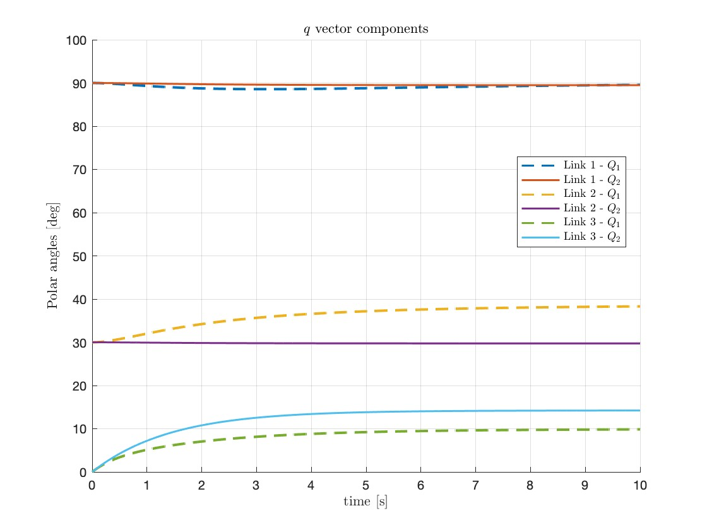

- `qdotVec4.jpg`: Q1 vs Q2 angular velocities  
  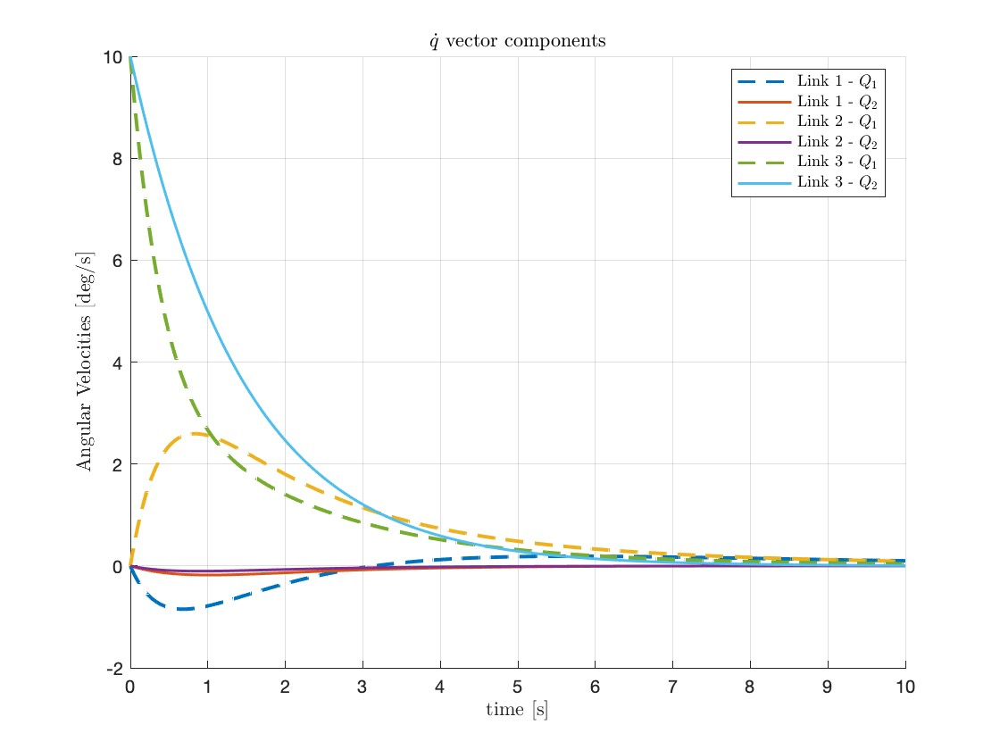

- `controlVecQ4.jpg`: Q1 vs Q2 control torques  
  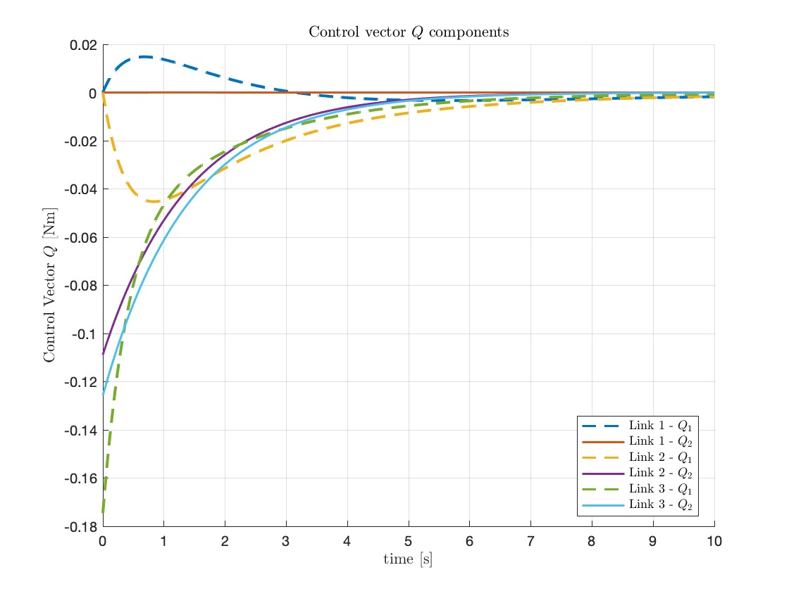

---

#### Q2 vs Q3 (**ΔM = +3I**)

- `qVec3.jpg`: Q2 vs Q3 joint angles  
  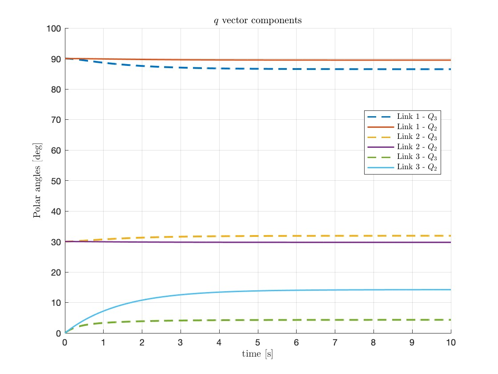

- `qdotVec3.jpg`: Q2 vs Q3 angular velocities  
  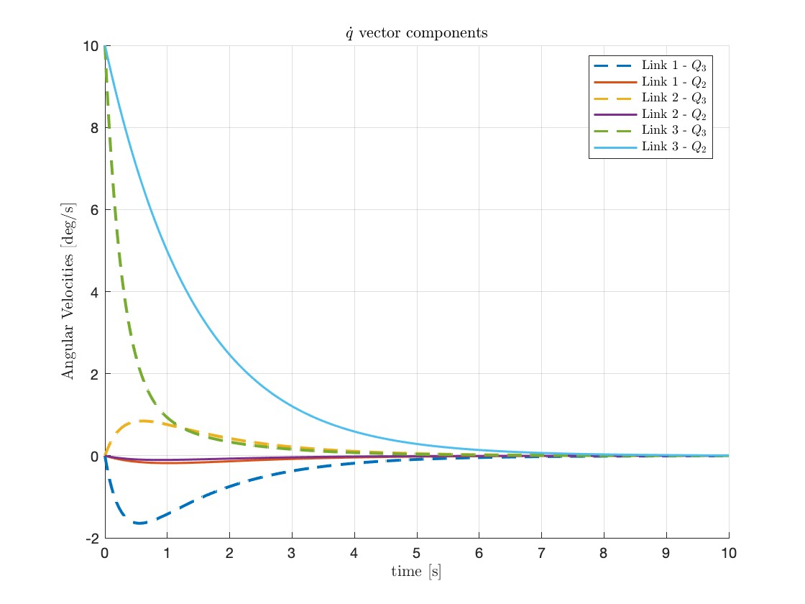

- `controlVecQ3.jpg`: Q2 vs Q3 control torques  
  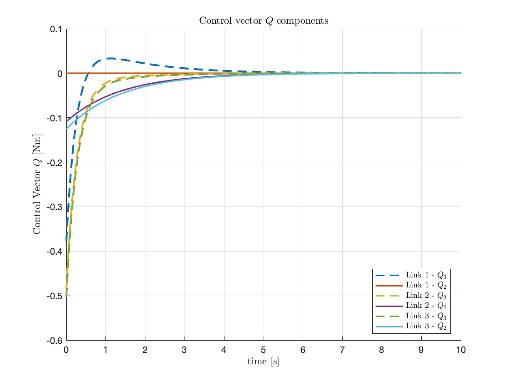

---

#### Q2 vs Q3 (**ΔM = -0.5I**)

- `qVec2.jpg`: Q2 vs Q3 joint angles  
  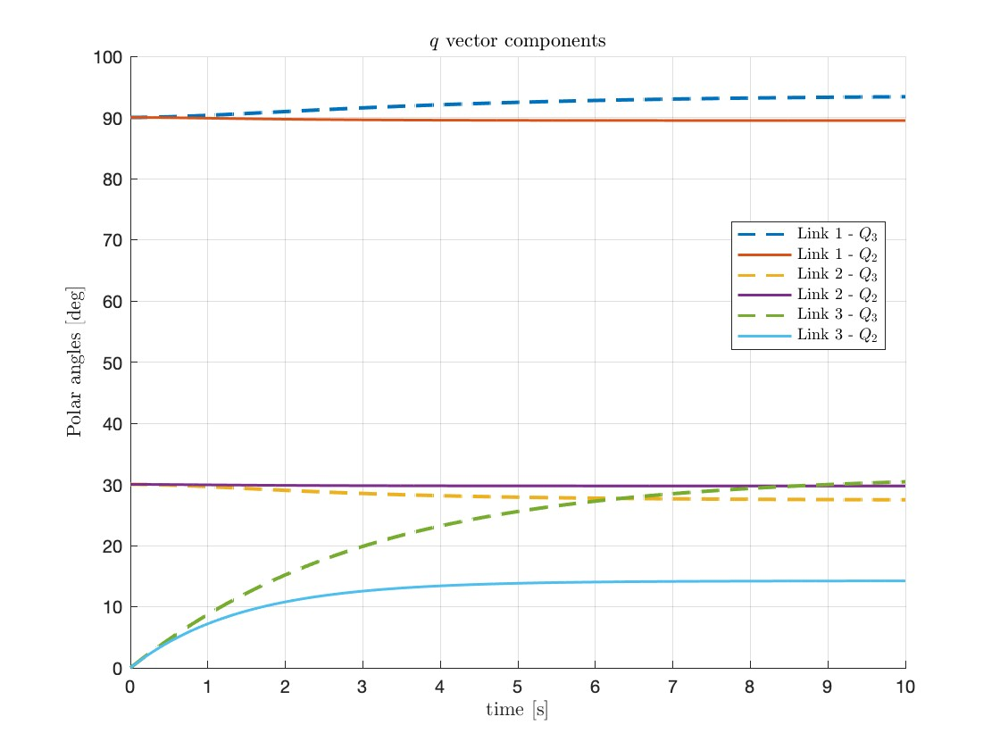

- `qdotVec2.jpg`: Q2 vs Q3 angular velocities  
  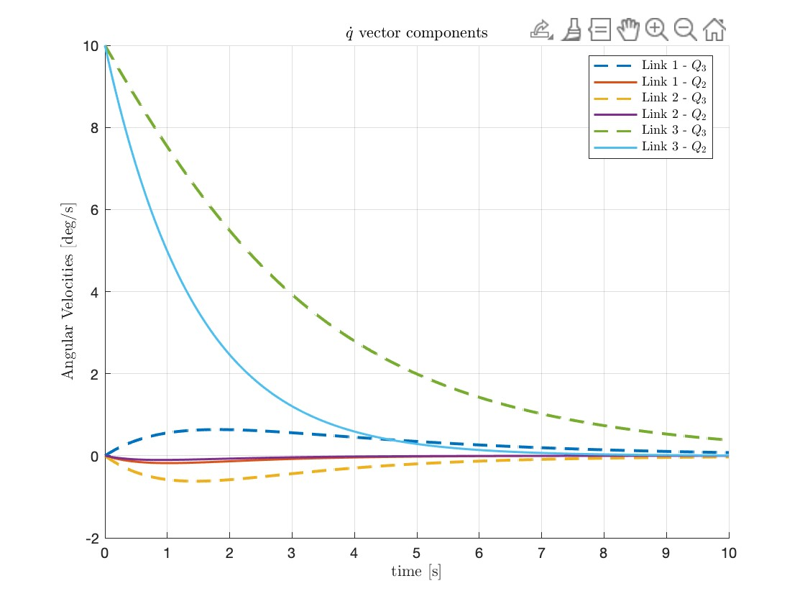

- `controlVecQ2.jpg`: Q2 vs Q3 control torques  
  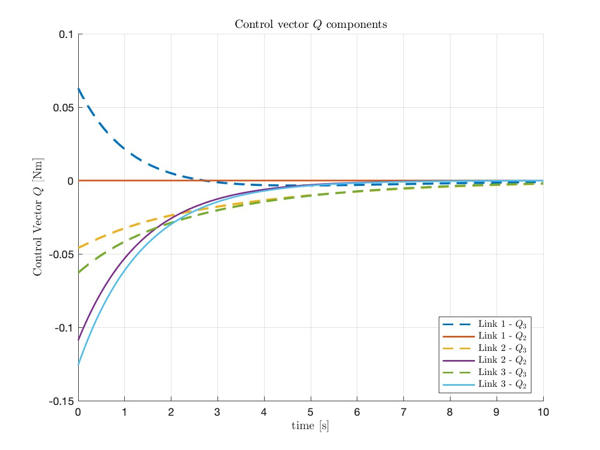

---

#### Q2 vs Q3 (**ΔM = -0.95I**)

- `qVec.jpg`: Q2 vs Q3 joint angles  
  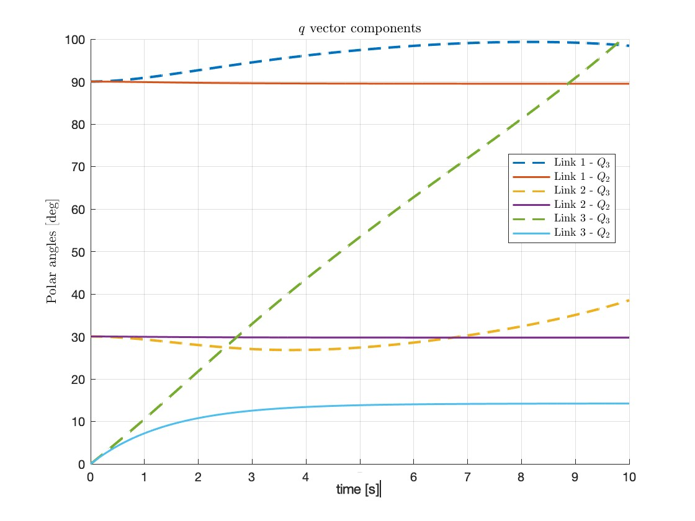

- `qdotVec.jpg`: Q2 vs Q3 angular velocities  
  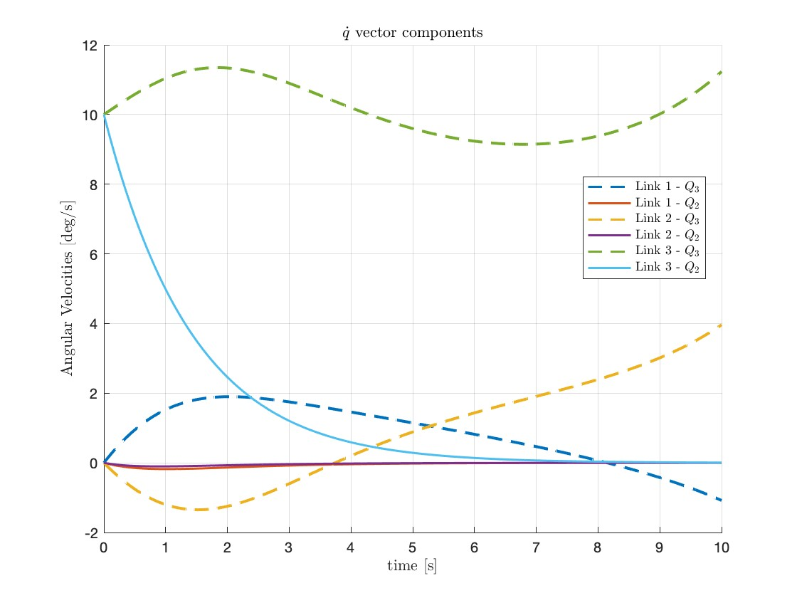

- `controlVecQ.jpg`: Q2 vs Q3 control torques  
  

---

## How to Run

1. Download the zip file off of main.
2. Open MATLAB (whatever version is prefered the more recent the better).
4. Run `AE544project2Ucles.m` in MATLAB.
5. Simulation outputs and plots will be saved and displayed automatically.

---

## GenAI Usage

ChatGPT was used to help:
- Clean up and comment on MATLAB code
- Grammar and spell check the README file

---
## Disclaimer
The code was fully made and tested in MATLAB 2024b, other version may encounter issues that have not yet been detected.
